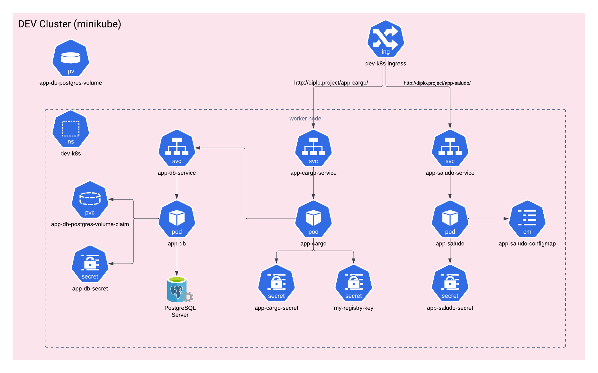

# Proyecto de Infraestructura para Aerolíneas

## Descripción del Proyecto

Somos una empresa del rubro de aerolíneas y estamos desarrollando un sistema que será utilizado por múltiples aerolíneas. Dado el alcance y la criticidad del proyecto, necesitamos una infraestructura que sea escalable, de alto rendimiento y adaptable a cambios. Este documento describe la arquitectura y los componentes de nuestro sistema.

## Arquitectura de Microservicios

El sistema está basado en una arquitectura de microservicios que facilita la escalabilidad y el mantenimiento. Actualmente, contamos con un clúster de Kubernetes que aloja dos microservicios principales:

### 1. `app-cargo`

- **Descripción**: `app-cargo` es el microservicio encargado de la gestión de carga y mercancías dentro del sistema. Está desarrollado en Python utilizando el framework **FastAPI**.
- **Componentes**:
  - **Pod**: Un pod ejecuta el contenedor de `app-cargo`.
  - **Base de datos**: El pod de `app-cargo` se conecta a un pod de base de datos **PostgreSQL** a través de un servicio.
  - **Imagen Docker**: La imagen de `app-cargo` se basa en un repositorio privado alojado en Docker Hub.

### 2. `app-saludo`

- **Descripción**: `app-saludo` es un microservicio más sencillo desarrollado en Python con **Flask**. Este servicio devuelve diferentes mensajes de saludo según la ruta que se llama.
- **Componentes**:
  - **Pod**: Un pod independiente ejecuta `app-saludo`.
  - **Imagen Docker**: La imagen de `app-saludo` se basa en un repositorio publico alojado en Docker Hub.

## Servicios

Para cada uno de los pods mencionados, hemos implementado servicios dentro del clúster de Kubernetes:

- **Servicio para `app-cargo`**: Expuesto internamente para que otros servicios dentro del clúster puedan comunicarse con él.
- **Servicio para `app-saludo`**: Similar al de `app-cargo`, expuesto para uso interno.
- **Servicio para `app-db`**: Este servicio maneja las conexiones a la base de datos PostgreSQL y está diseñado para ser accesible solo dentro del clúster.

## Ingress

Para gestionar el tráfico externo, hemos configurado un **Ingress** que enruta las solicitudes HTTP hacia los microservicios adecuados. El Ingress está configurado para:

- **Ruta**: `http://diplo.project/`
  - **Subruta `/cargo`**: Dirige las solicitudes hacia `app-cargo`.
  - **Subruta `/saludo`**: Dirige las solicitudes hacia `app-saludo`.

Importante: El servicio de la base de datos `app-db` no está expuesto al exterior y solo es accesible desde los microservicios dentro del clúster.

## Diagrama de Infraestructura

A continuación se muestra un diagrama visual de la infraestructura:

## Conclusión

La infraestructura descrita aquí proporciona una base sólida y flexible para el desarrollo y la expansión futura del sistema de aerolíneas. La arquitectura de microservicios garantiza que podemos escalar y mantener los componentes del sistema de manera eficiente, mientras que la configuración del Ingress asegura que solo los servicios necesarios están expuestos al tráfico externo.

